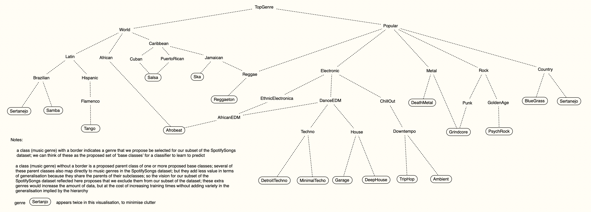

# Spotify Songs and Music Genres

This repo describes a tabular classification dataset and a companion, custom OWL ontology class hierarchy.

# The Spotify Songs dataset

dataset name: 114000 Spotify Songs
* a tabular dataset whose features describe characteristics of songs on Spotify
* the objective is to classify the songs according to their **music genre**
* features: 19
  - 4 of these are string names, so are of no use
  - 2 of the remaining 15 features are categorical, one with 12 levels and one with 5 levels; if we imagine converting these two categorical features to binary features (12 and 5, respectively), we would have 13 + 12 + 5 = 30 features
* classes: 114  (114 unique music genres)
  - we don't have to use them all; we can choose a subset of genres that help to form an interesting music genre class hierarchy
  - the Kaggle page for the dataset says the dataset has 125 genre classes, but this is inaccurate. Analysis of the dataset shows that the data samples refer to 114 unique genres
* balance: each of the 114 music genres has exactly 1000 data samples

available at:
* https://www.kaggle.com/datasets/priyamchoksi/spotify-dataset-114k-songs
* If you don't already have an account on Kaggle, you may need to register in order to access and download the dataset (not sure).

`explore_spotifySongs_dataset.py`
* a script for getting familiar with the dataset
* performs some rudimentary exploratory data analysis
* feel free to use it as a starting point for evaluating the dataset
* download the dataset; place it somewhere on your local drive; adjust the directory locations in the script; run each section and inspect the results written to your console

`The 114 track genres.txt`
* a listing of the 114 track genres (classes) in the dataset

the idea behind working with this dataset
* 114 classes (music genres) is more than we need or want, but that's ok, we don't need to use the whole dataset; we can select a subset whose shape we like
* because the dataset is so nicely balanced, we can select whichever subset of music genres we prefer and still have a perfectly balanced dataset with enough data that we can safely split the master subset into training, validation and test subsets
* the domain of music genres lends itself to class hierarchy creation; the domain is both flexible and familiar; crafting a reasonable companion music genre class hierarchy looks feasible

datawrangling
* the exploratory data analysis suggests some data wrangling of the input features may be appropriate
* feature 'key' (the key of the song, presumably) is categorical, with 12 levels indicated by integers 0 to 11; consider converting this one categorical feature into binary features 
* feature 'time_signature' is categorical, with 5 levels indicated by integers; consider converting this one categorical feature into binary features
* if we select a subset of the 114 music genres, the number of levels of these two categorical features present in our subset may be lower than 11 and 5, respectively; so we won't know how many binary features we need until we've settled on the precise set of music genres we want as our base classes

# The MusicGenres OWL class hierarchy

`MusicGenres.ttl`
* a custom OWL class hierarchy of music genres
* it's just an example or starting point for modification and/or reduction or extension
* current total number of classes: 43
* current number of SpotifySongs dataset base classes: 20
* the corresponding subset of the SpotifySongs dataset would have 20 * 1000 = 20,000 data samples

`MusicGenres_class_hierarchy.png`
* a visualisation of the MusicGenres OWL class hierarchy

Influences that helped shape the design of the MusicGenres OWL class hierarchy
* https://musicmap.info/
  - a genealogy of popular music genres
* https://en.wikipedia.org/wiki/List_of_music_genres_and_styles
  - a list (hierarchy) of music genres and styles
* hierarchy depth considerations: from amongst the 114 music genres in the dataset, we had a preference for those base classes that we can place deep within a class hierarchy --- i.e. so that they have multiple parent classes
* hierarchy width considerations: from amongst the 114 music genres in the dataset, we selected base classes that give a wide variety of different subsumption paths in the hierarchy; that is, we want different base classes to have differences in their sets of parent classes
* hierarchy variety considerations: in a class hierarchy, it's valid for any given class to have more than one direct parent class; so we selected base classes from the SpotifySongs dataset partly based on the opportunities they created for defining instances of multiple parentage in the class hierarchy
* personal bias

